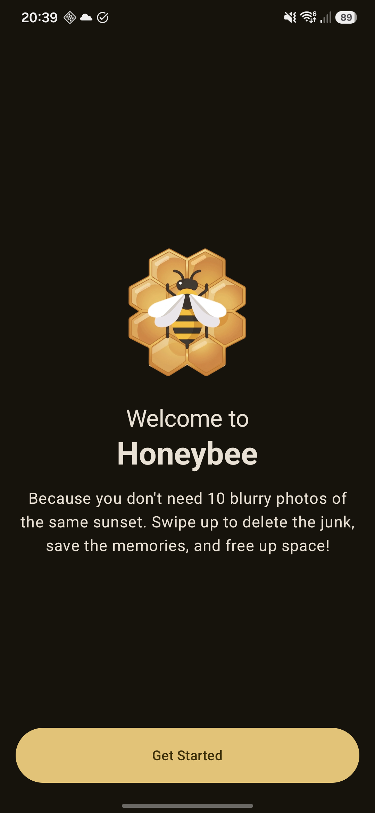
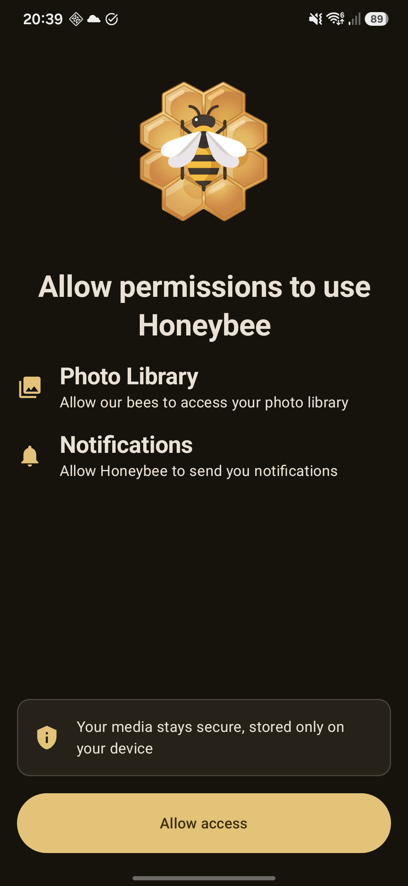
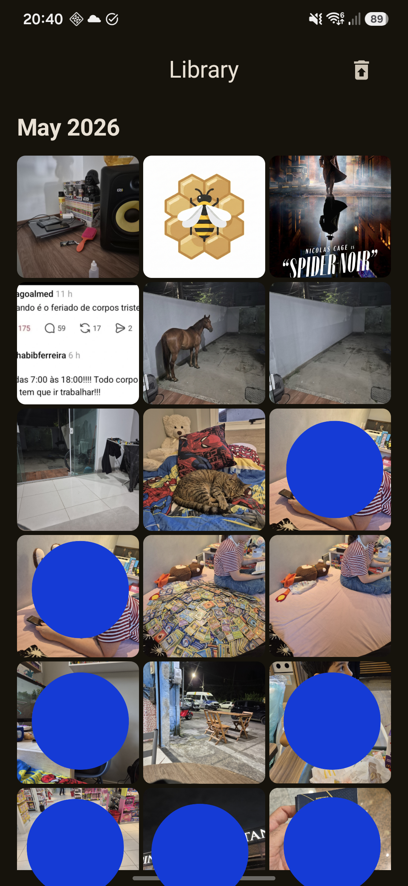
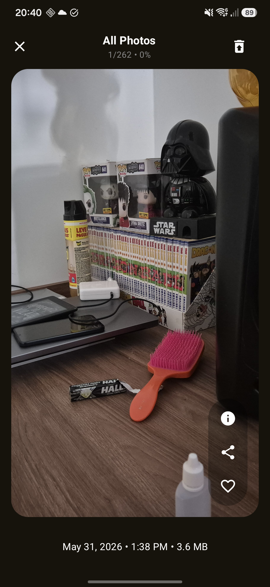
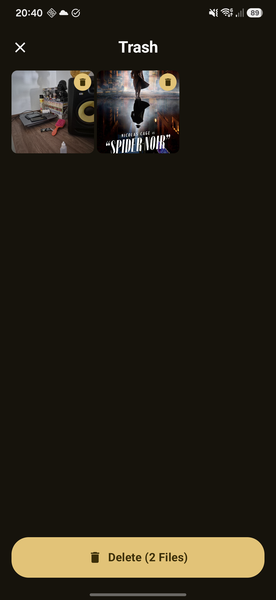
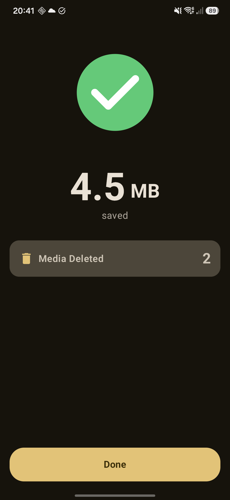

# Honeybee 🐝

Honeybee is a modern Android application designed for photo library management, sorting, details tracking, and secure media deletion built with cutting-edge Android development patterns and tools.

---

## 📷 Screenshots
<p float="center">
  
  
  
  
  
  
</p>

## 🚀 Tech Stack

The application leverages standard, modern libraries and APIs in the Android ecosystem:

| Category                     | Technology / Library                          |
|:-----------------------------|:----------------------------------------------|
| **UI Framework**             | Jetpack Compose (Material 3 Expressive APIs)  |
| **Image Loading**            | Coil (Compose)                                |
| **Animation**                | Lottie (Compose)                              |
| **Dependency Injection**     | Hilt                                          |
| **Asynchronous Programming** | Kotlin Coroutines & Kotlin Flow               |
| **Serialization**            | Kotlinx Serialization                         |
| **Database**                 | Room Database                                 |
| **Network**                  | Retrofit (with OkHttp interceptors)           |
| **Navigation**               | `androidx.navigation3` (Jetpack Navigation 3) |
| **Build Tool**               | Gradle (Kotlin DSL) with Version Catalogs     |

**Min SDK:** 26 | **Target SDK:** 36

---

## 🏛️ Architecture Overview

The codebase is structured following **Clean Architecture** principles combined with the **MVI (Model-View-Intent)** design pattern to enforce unidirectional data flow, modularity, and high testability.

### Module Structure
The project is split into separate feature and core modules:
* **`:core`**: Contains shareable features like design system tokens, database drivers, common abstractions, testing rules, and utilities.
* **`:feature`**: Self-contained business feature modules (e.g., `:feature:library`, `:feature:onboarding`).
  * Features are partitioned into `api` and `impl` modules to decouple interfaces from implementations.
  * Visibility is restricted: Domain models, ViewModels, Use Cases, and Repositories are kept `internal` to their modules. Only navigation routes are exposed publicly.

### Presentation Pattern: MVI
The UI layer operates on a unidirectional state flow powered by three base ViewModels:
1. **`ViewModel<State, Event, Effect>`**: Handles UI state, receives user intents (events), and emits one-shot side-effects (e.g., navigation, toasts).
2. **`StateViewModel<State, Event>`**: Used when events and state changes are required but no side-effects are emitted.
3. **`EffectViewModel<Effect>`**: Exposes only effects for screens with no complex state or events.

**Unidirectional Data Flow:**
1. **User Action / Event:** Screen dispatches a `UiEvent` by calling `viewModel.dispatchEvent(event)`.
2. **State Updates:** ViewModel handles the event and updates the immutable `UiState` via `setState { }`. The Screen observes the state flow and recomposes.
3. **Side Effects:** ViewModel dispatches one-shot side-effects (e.g., navigation, toasts) using `sendEffect { }`. The Screen collects them using `CollectUiEffects(viewModel.uiEffect)`.

---

## 🛠️ Build and Development

### Compile Project
Verify changes by compiling the debug Kotlin source:
```bash
./gradlew compileDebugKotlin
```

### Run Unit Tests
Execute unit tests for all modules:
```bash
./gradlew testDebugUnitTest
```
