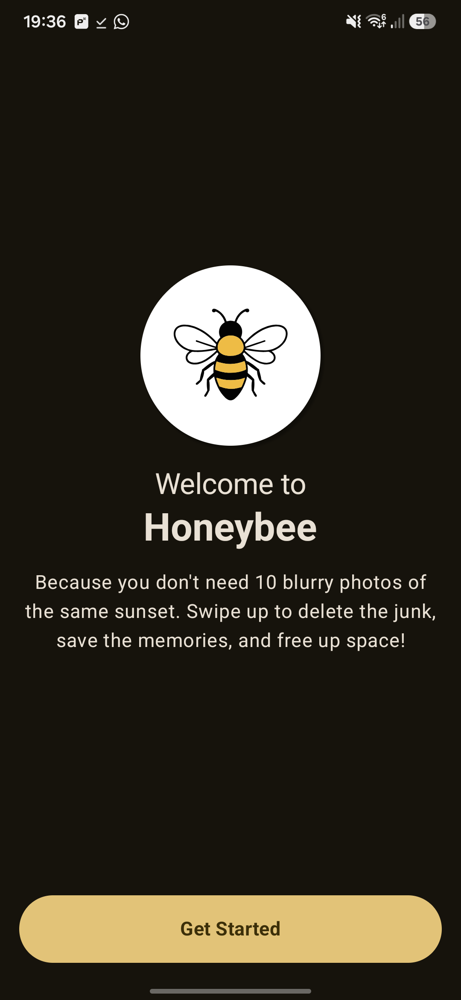
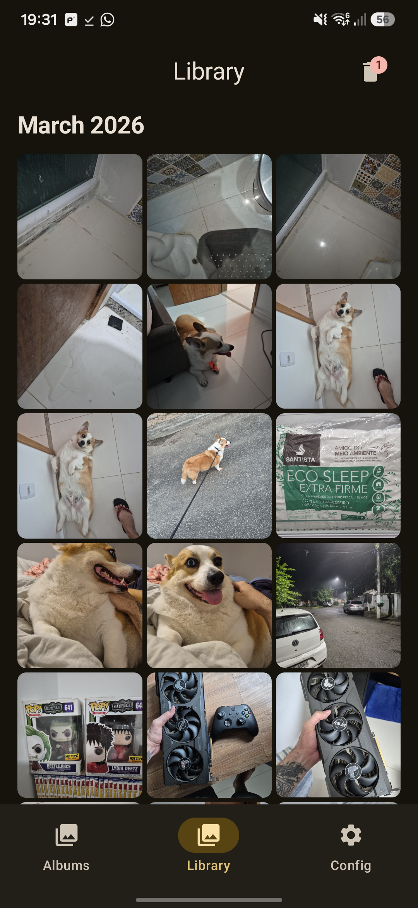
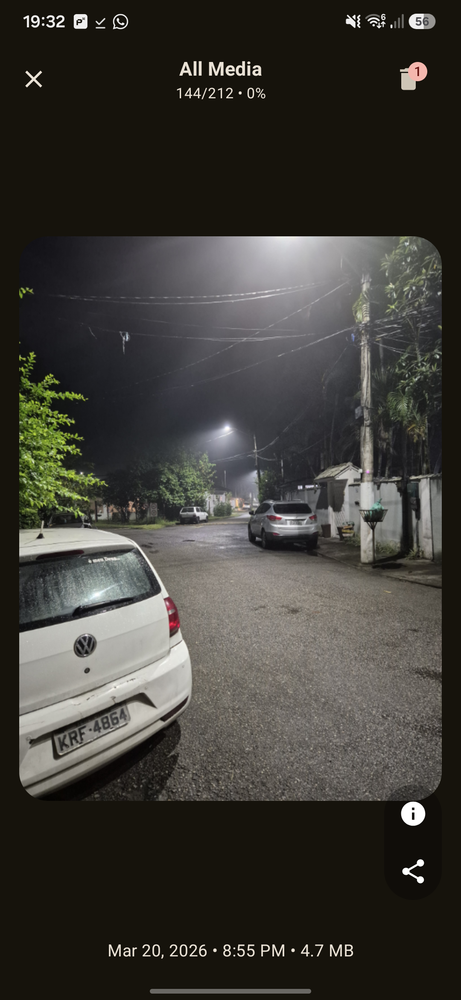
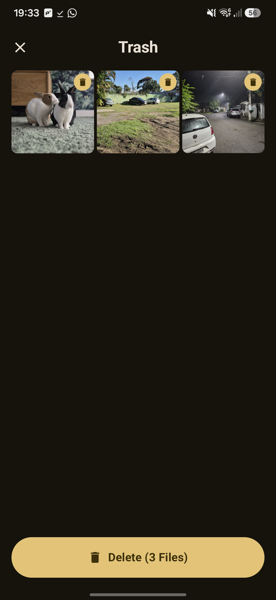
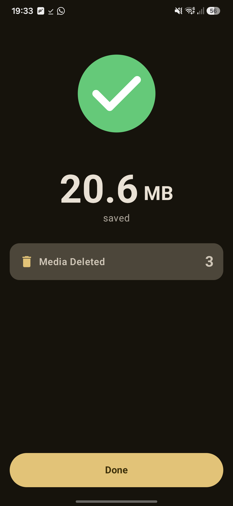
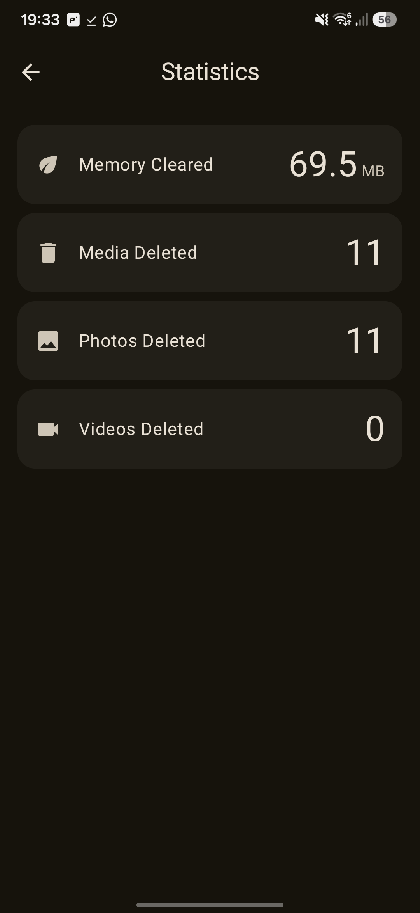
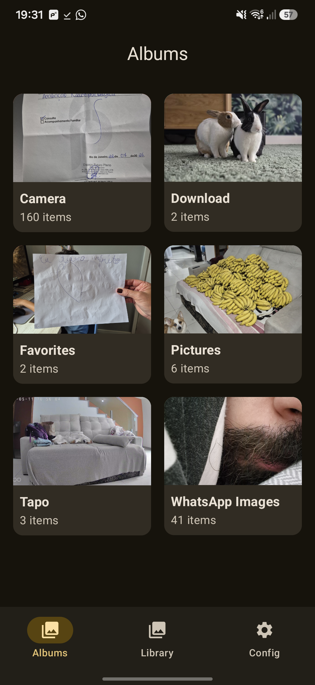

# Honeybee 🐝

Swipe through photos and videos, clear the clutter, and reclaim your storage.

## Description

Your best memories deserve space—not endless duplicates, blurry shots, and forgotten videos.

Honeybee makes cleaning up your photo library quick and satisfying. Browse your photos and videos, swipe up to move unwanted items to the trash, and keep the moments that matter.

Review everything before deleting it permanently, or restore anything you change your mind about. Honeybee gives you control while helping you reclaim valuable storage space.

With Honeybee, you can:
- Quickly review photos and videos
- Swipe up to clear unwanted media
- Restore items from the trash before deletion
- Browse your library by month or album
- View photos in full screen and play videos
- Mark your favorite memories
- Share photos and videos
- Check file size and date information
- Track how many files you’ve deleted and how much space you’ve recovered

Private by design:
Your photos and videos remain stored on your device. Honeybee only accesses your media with your permission.

Less clutter. More space. Keep the memories that matter with Honeybee.

## 📷 Screenshots

<p float="center">
  
  
  
  
  
  
  
</p>

## 🚀 Tech Stack

The application leverages standard, modern libraries and APIs in the Android ecosystem:

| Category                     | Technology / Library                                                        |
|:-----------------------------|:----------------------------------------------------------------------------|
| **UI Framework**             | Jetpack Compose (Material 3 Expressive APIs, Adaptive Navigation Suite)     |
| **Image Loading**            | Coil (Compose with video decoding support)                                  |
| **Video Playback**           | Jetpack Media3 (ExoPlayer & UI components)                                  |
| **Animation**                | Lottie (Compose integration)                                                |
| **Push Notifications**       | Firebase Cloud Messaging (FCM)                                              |
| **Dependency Injection**     | Hilt (Dagger Hilt Android)                                                  |
| **Asynchronous Programming** | Kotlin Coroutines & Kotlin Flow                                             |
| **Serialization**            | Kotlinx Serialization                                                       |
| **Local Storage**            | DataStore Preferences & Android SharedPreferences                           |
| **Media Access**             | Android MediaStore & ContentResolver                                        |
| **Navigation**               | `androidx.navigation3` (Jetpack Navigation 3)                               |
| **Build Tool**               | Gradle (Kotlin DSL) with Version Catalogs                                   |

**Min SDK:** 26 | **Target SDK:** 37

---

## 🏛️ Architecture Overview

The codebase is structured following **Clean Architecture** principles combined with the **MVI (Model-View-Intent)** design pattern to enforce unidirectional data flow, modularity, and high testability.

### Module Structure

The project is divided into distinct Gradle modules to enforce separation of concerns:

#### 1. App Module (`:app`)
* Serves as the application entry point ([HoneybeeApplication](file:///C:/Users/lf/AndroidStudioProjects/honeybee/app/src/main/java/com/luisfagundes/honeybee/HoneybeeApplication.kt)).
* Hosts [MainActivity](file:///C:/Users/lf/AndroidStudioProjects/honeybee/app/src/main/java/com/luisfagundes/honeybee/presentation/activity/MainActivity.kt), [AppNavDisplay](file:///C:/Users/lf/AndroidStudioProjects/honeybee/app/src/main/java/com/luisfagundes/honeybee/presentation/navigation/AppNavDisplay.kt) (top-level routing using Navigation 3), and notification receivers.
* Implements product flavors (`free` and `paid`) to support different subscription features via Hilt DI.

#### 2. Core Modules (`:core`)
* **`:core:common`**: Contains design patterns, core architecture base classes ([ViewModel](file:///C:/Users/lf/AndroidStudioProjects/honeybee/core/common/src/main/java/com/luisfagundes/core/common/presentation/arch/viewmodel/ViewModel.kt), [StateViewModel](file:///C:/Users/lf/AndroidStudioProjects/honeybee/core/common/src/main/java/com/luisfagundes/core/common/presentation/arch/viewmodel/StateViewModel.kt), [EffectViewModel](file:///C:/Users/lf/AndroidStudioProjects/honeybee/core/common/src/main/java/com/luisfagundes/core/common/presentation/arch/viewmodel/EffectViewModel.kt)), coroutine dispatchers, resource managers, and global tools.
* **`:core:designsystem`**: Houses styling elements including theme, custom color palette, layout spacings, and shared M3 components (e.g., [HoneybeeButton](file:///C:/Users/lf/AndroidStudioProjects/honeybee/core/designsystem/src/main/java/com/luisfagundes/designsystem/components/HoneybeeButton.kt), [HoneybeeErrorTemplate](file:///C:/Users/lf/AndroidStudioProjects/honeybee/core/designsystem/src/main/java/com/luisfagundes/designsystem/components/HoneybeeErrorTemplate.kt), [HoneybeeLoadingTemplate](file:///C:/Users/lf/AndroidStudioProjects/honeybee/core/designsystem/src/main/java/com/luisfagundes/designsystem/components/HoneybeeLoadingTemplate.kt)).
* **`:core:testing`**: Common test helpers such as [MainDispatcherRule](file:///C:/Users/lf/AndroidStudioProjects/honeybee/core/testing/src/main/java/com/luisfagundes/core/testing/MainDispatcherRule.kt) to simplify coroutine testing.

#### 3. Feature Modules (`:feature`)
Each business feature is split into an `api` (navigation interfaces/contracts) and an `impl` module (actual UI and business logic implementation):
* **`:feature:onboarding`**: Controls the introductory screens and permission request flow.
* **`:feature:library`**: The main photo and video view, sorting controls, detail viewer, video player, and the trash manager.
* **`:feature:config`**: App configuration, settings (notifications, statistics, support feedback screen).
* **`:feature:albums`**: Manages customized photo albums.

> [!NOTE]
> All domain models, ViewModels, Use Cases, and Repositories are scoped `internal`. Only navigation routes and api interfaces are declared `public` to enforce strict modular boundaries.

### Presentation Pattern: MVI

The presentation layer uses three base ViewModels located in `:core:common`:
1. **`ViewModel<State, Event, Effect>`**: Manages UI state, handles user events, and fires one-shot side-effects (e.g. navigation, toasts).
2. **`StateViewModel<State, Event>`**: Used for screens requiring state and events but no side-effects.
3. **`EffectViewModel<Effect>`**: For simple screens emitting side-effects without internal business state.

**Unidirectional Data Flow (UDF):**
```text
         +-------------------+
         |  Compose Screen   | <---------------------------+
         +-------------------+                             |
                   |                                       |
                   | (dispatches                           | (observes &
                   |  UiEvent)                             |  recomposes)
                   v                                       |
         +-------------------+                             |
         |   MVI ViewModel   |                             |
         +-------------------+                             |
           /               \                               |
          / (updates        \ (emits                       |
         /   state)          \ side-effects)               |
        v                     v                            |
+---------------+     +------------------+                 |
|  UiState Flow |     | UiEffect Channel |                 |
+---------------+     +------------------+                 |
        |                      |                           |
        +----------+-----------+                           |
                   |                                       |
                   | (collects & executes)                 |
                   +---------------------------------------+
```

1. **User Action / Event:** The screen dispatches a [UiEvent](file:///C:/Users/lf/AndroidStudioProjects/honeybee/core/common/src/main/java/com/luisfagundes/core/common/presentation/arch/event/UiEvent.kt) by calling `viewModel.dispatchEvent(event)`.
2. **State Updates:** The ViewModel processes the event and updates the immutable [UiState](file:///C:/Users/lf/AndroidStudioProjects/honeybee/core/common/src/main/java/com/luisfagundes/core/common/presentation/arch/state/UiState.kt) via `setState { }` or `setStateOf<T> { }`. The Compose screen observes `uiState` and updates the UI accordingly.
3. **Side Effects:** Navigation or transient interactions are sent as [UiEffect](file:///C:/Users/lf/AndroidStudioProjects/honeybee/core/common/src/main/java/com/luisfagundes/core/common/presentation/arch/effect/UiEffect.kt) via `sendEffect { }` and collected by the screen with `CollectUiEffects(viewModel.uiEffect)`.

---

## 🛠️ Build and Development

### Compile Project
Verify changes by compiling the debug Kotlin source:
```bash
./gradlew compileDebugKotlin
```

### Run Unit Tests
Execute unit tests for all modules (using JUnit 5, MockK, and Turbine):
```bash
./gradlew testDebugUnitTest
```
